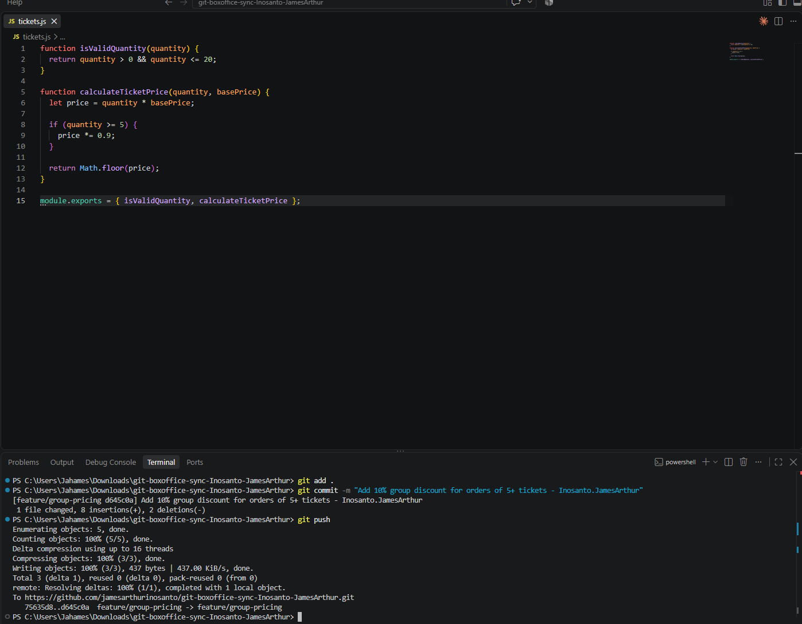
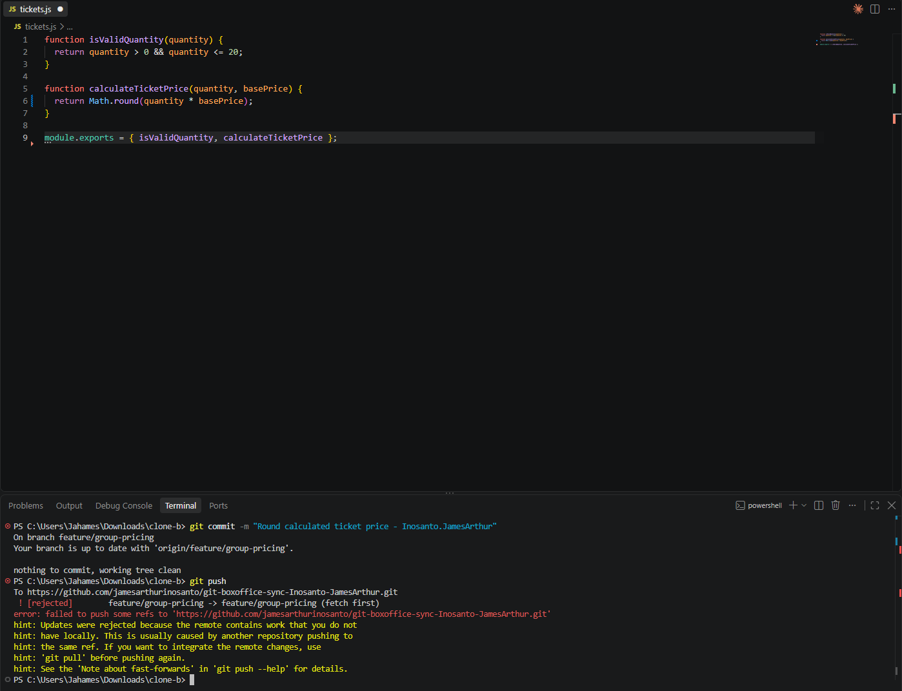
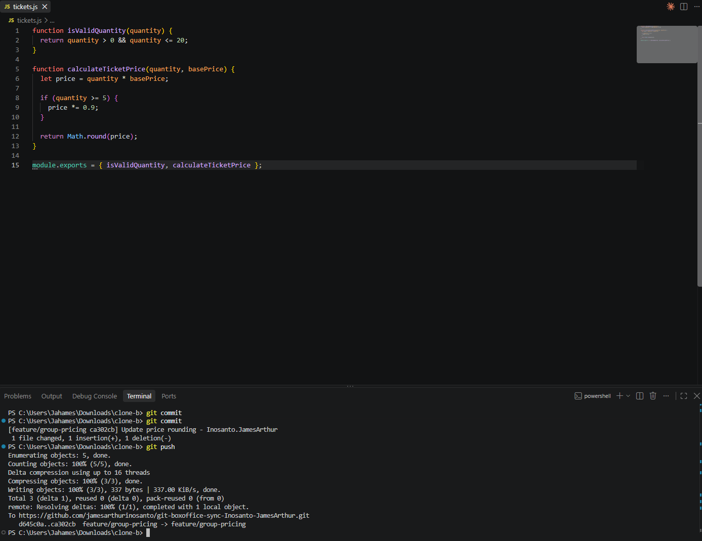
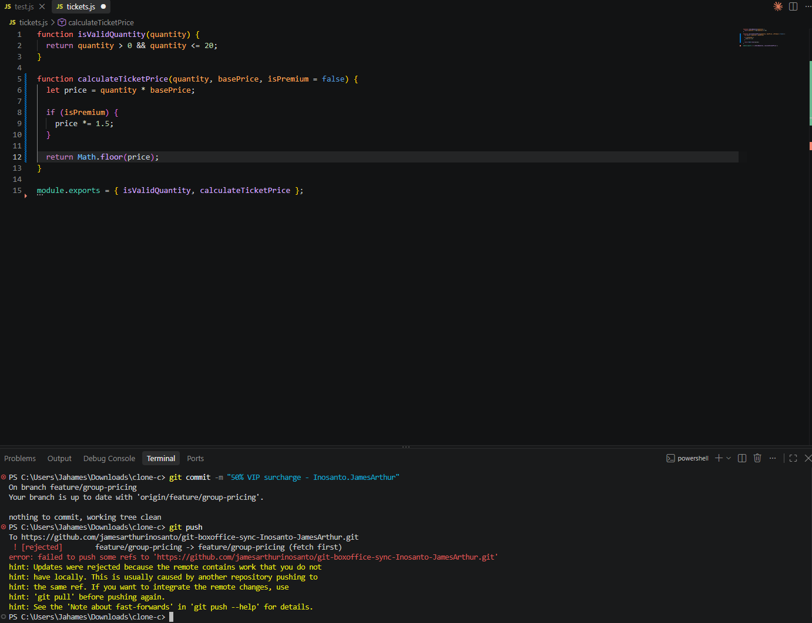
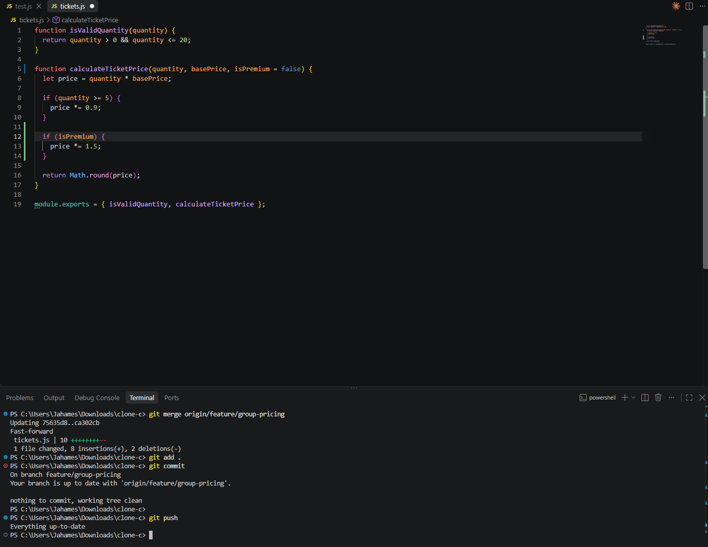
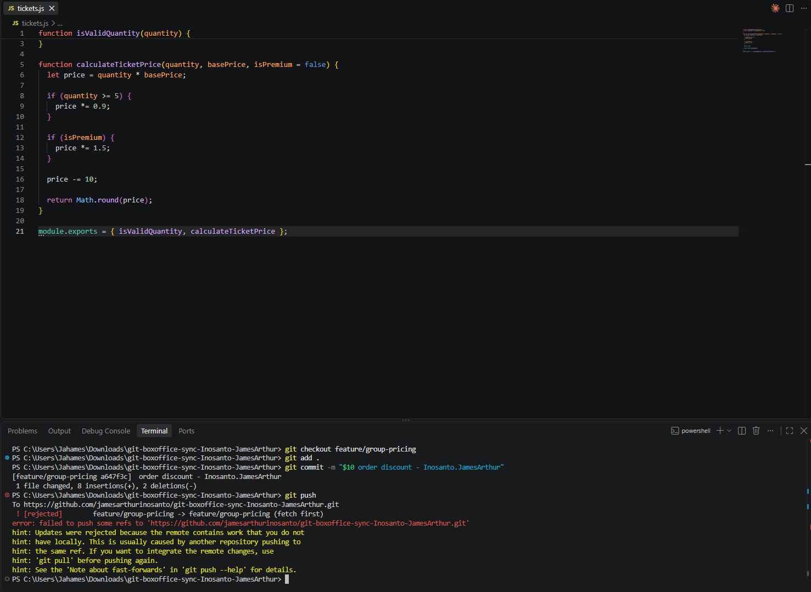
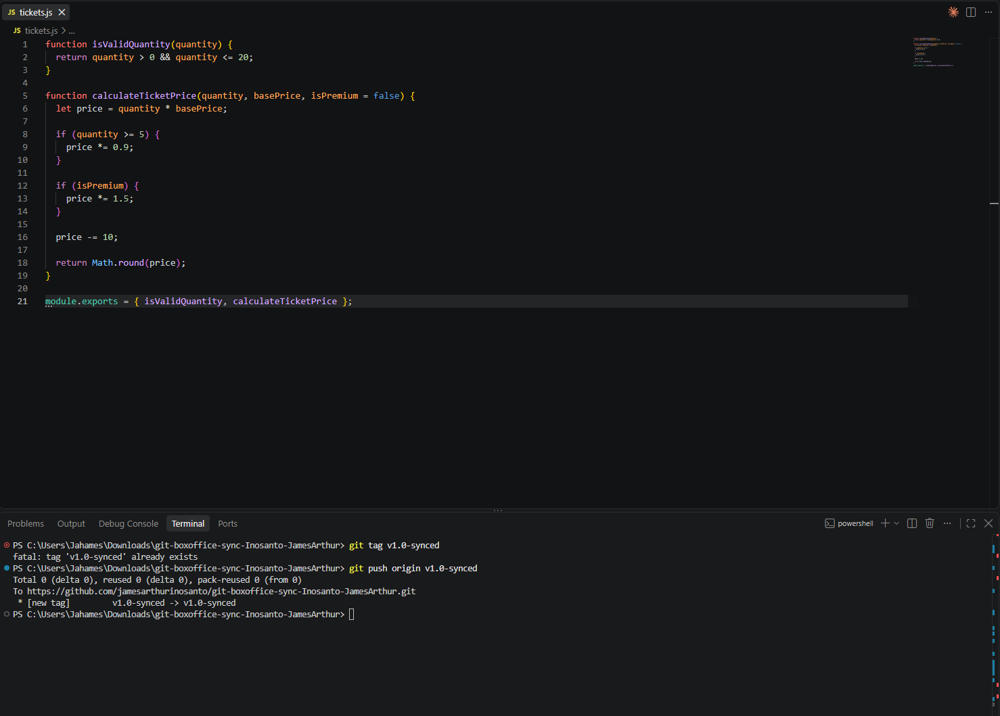
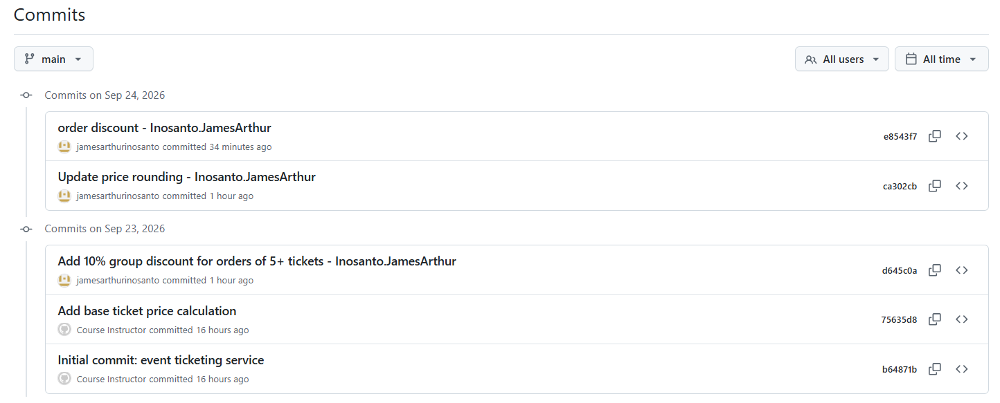

# Git Workflow Lab

## Task 1 — Push a change from Clone A

I added a 10% discount for orders of 5 or more tickets and committed
the change from Clone A. The change was successfully pushed to the
feature/group-pricing branch.

